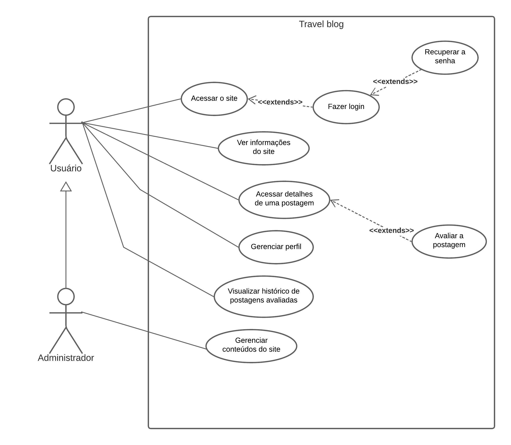

# Especificações do Projeto

Pré-requisitos: <a href="1-Documentação de Contexto.md"> Documentação de Contexto</a>

Definição do problema e ideia de solução a partir da perspectiva do usuário. É composta pela definição do  diagrama de personas, histórias de usuários, requisitos funcionais e não funcionais além das restrições do projeto.

Apresente uma visão geral do que será abordado nesta parte do documento, enumerando as técnicas e/ou ferramentas utilizadas para realizar a especificações do projeto

## Personas

Persona 1 - Marina, a Exploradora Iniciante:
Marina é uma jovem universitária que sempre sonhou em viajar, mas nunca teve a oportunidade. Ela tem conhecimento básico de tecnologia e usa principalmente seu smartphone para redes sociais e mensagens. Seu objetivo é planejar sua primeira viagem ao exterior e está procurando informações confiáveis sobre destinos populares, orçamento e como montar um itinerário.

Persona 2 - Pedro, o Viajante Experiente:
Pedro é um engenheiro de software com um amor profundo por viagens e culturas diferentes. Ele é um usuário experiente de tecnologia e adora usar aplicativos para otimizar sua experiência de viagem. Pedro está planejando uma viagem de voluntariado para um país em desenvolvimento e está em busca de informações específicas sobre voluntariado, acomodação local e dicas para interações culturais autênticas.

Persona 3 - Lúcia, a Viajante Insegura:

Lúcia é uma mulher na faixa dos 30 anos, que sempre teve o desejo de explorar novos lugares, mas se sente sobrecarregada pela enxurrada de informações nas redes sociais. Ela trabalha como professora do ensino médio e tem um relacionamento amoroso com a tecnologia, mas não é tão experiente quanto alguns de seus colegas quando se trata de utilizá-la para planejar viagens. A constante exposição a notícias contraditórias e opiniões divergentes na internet a deixa insegura sobre as decisões que precisa tomar em relação às suas viagens.

Enumere e detalhe as personas da sua solução. Para tanto, baseie-se tanto nos documentos disponibilizados na disciplina e/ou nos seguintes links:

> **Links Úteis**:
> - [Rock Content](https://rockcontent.com/blog/personas/)
> - [Hotmart](https://blog.hotmart.com/pt-br/como-criar-persona-negocio/)
> - [O que é persona?](https://resultadosdigitais.com.br/blog/persona-o-que-e/)
> - [Persona x Público-alvo](https://flammo.com.br/blog/persona-e-publico-alvo-qual-a-diferenca/)
> - [Mapa de Empatia](https://resultadosdigitais.com.br/blog/mapa-da-empatia/)
> - [Mapa de Stalkeholders](https://www.racecomunicacao.com.br/blog/como-fazer-o-mapeamento-de-stakeholders/)
>
Lembre-se que você deve ser enumerar e descrever precisamente e personalizada todos os clientes ideais que sua solução almeja.

## Histórias de Usuários

Com base na análise das personas forma identificadas as seguintes histórias de usuários:

| EU COMO... `MARINA, a exploradora iniciante` |  QUERO/PRECISO ... `FUNCIONALIDADE`      | PARA ... `MOTIVO/VALOR`                              |
|----------------------------------------------|------------------------------------------|----------------------------------------------------  |
| Usuária do sistema                           | Registrar minhas tarefas                 | Manter o controle de uso                             |
| Fotógrafa                                    | Fazer Uploads de imagens                 | Registrar lugares visitados                          |
| Criadora de conteúdo                         | Layout responsivo                        | Abrir em qualquer dispositivo de forma responsiva    |
| exploradora iniciante                        | Filtros de busca e organização           | Melhor experiência de usuário                        |
| Bilíngue                                     | Opção de mudança de idiomas              | Para se comunicar melhor onde estiver                |

| EU COMO... `PEDRO, o viajnate experiente`    |  QUERO/PRECISO ... `FUNCIONALIDADE`      | PARA ... `MOTIVO/VALOR`                              |
|----------------------------------------------|------------------------------------------|----------------------------------------------------  |
| Usuário do sistema                           | Relatar experiências de viagem           | Dar dicas de viagem para pessoas que estão iniciando |
| Jornalista                                   | Forúns de discussão                      | Dar avaliação e dicas de preços e hotéis             |
| Exigente                                     | Pesquisar destinos e marcar lugares visitados | Para explorar novos lugares                     |
| Objetivo no quer                             | Otimização no Blog                       | Para abrir com facilidade onde estiver               |
| Guia turístico                               | Postar fotos com descrição               | Fazer anúncios de lugares em promoção 

| EU COMO... `LUCIA, a viajante insegura`      |  QUERO/PRECISO ... `FUNCIONALIDADE`      | PARA ... `MOTIVO/VALOR`                              |
|----------------------------------------------|------------------------------------------|----------------------------------------------------  |
| Usuária do sistema                           | Fazer registros simples                  | Conseguir manter a manutenção no blog                |
| Insegura                                     | Artigos e guias                          | Ter um melhor direcionamento do destino              |
| Organizada                                   | Check-list e lista de preparativos       | Documentos necessários para levar para cada destino  |
| Questionadora                                | Um serviço de FAQ                        | Em caso de emergências                               |

Apresente aqui as histórias de usuário que são relevantes para o projeto de sua solução. As Histórias de Usuário consistem em uma ferramenta poderosa para a compreensão e elicitação dos requisitos funcionais e não funcionais da sua aplicação. Se possível, agrupe as histórias de usuário por contexto, para facilitar consultas recorrentes à essa parte do documento.

> **Links Úteis**:
> - [Histórias de usuários com exemplos e template](https://www.atlassian.com/br/agile/project-management/user-stories)
> - [Como escrever boas histórias de usuário (User Stories)](https://medium.com/vertice/como-escrever-boas-users-stories-hist%C3%B3rias-de-usu%C3%A1rios-b29c75043fac)
> - [User Stories: requisitos que humanos entendem](https://www.luiztools.com.br/post/user-stories-descricao-de-requisitos-que-humanos-entendem/)
> - [Histórias de Usuários: mais exemplos](https://www.reqview.com/doc/user-stories-example.html)
> - [9 Common User Story Mistakes](https://airfocus.com/blog/user-story-mistakes/)

## Requisitos

As tabelas que se seguem apresentam os requisitos funcionais e não funcionais que detalham o escopo do projeto.

### Requisitos Funcionais

|ID    | Descrição do Requisito  | Prioridade |
|------|-----------------------------------------|----|
|RF-001| O usuário pode acessar o site com ou sem login | MÉDIA |
|RF-002| O usuário pode recuperar a senha caso a esqueça | MÉDIA | 
|RF-003| O usuário pode visualizar a página inicial com informações práticas.| ALTA |
|RF-004| O usuário pode acessar detalhes de uma postagem.| MÉDIA |
|RF-005| O usuário pode avaliar (com gostei ou não gostei) alguma postagem.| MÉDIA |
|RF-006| O usuário pode gerenciar o seu perfil, mudando suas informações pessoais e credenciais de login.| ALTA |
|RF-007| O usuário pode visualizar o seu histórico de postagens avaliadas.| BAIXA |
|RF-008| O usuário administrador pode gerenciar o conteúdo do site.| ALTA |

### Requisitos não Funcionais

|ID     | Descrição do Requisito  |Prioridade |
|-------|-------------------------|----|
|RNF-001| O sistema deve ser intuitivo e fácil de navegar, mesmo para usuários não técnicos. | MÉDIA |
|RNF-002| O sistema deve ser responsivo para rodar em um dispositivos móvel | MÉDIA | 
|RNF-003| Deve processar requisições do usuário em no máximo 3s |  BAIXA | 
|RNF-004| O código do sistema deve ser organizado e bem documentado para que futuras atualizações e correções possam ser implementadas com facilidade | BAIXA |
|RNF-005| As URLs das postagens e páginas devem ser claras e amigáveis para os mecanismos de busca |  BAIXA |
|RNF-006| O blog deve permitir a configuração de meta tags personalizadas para melhorar o SEO de cada postagem |  MÉDIA |
|RNF-007| O blog deve facilitar o compartilhamento de postagens em plataformas de mídia social |  BAIXA |
|RNF-008| Deve ser possível incorporar imagens, vídeos e outros tipos de mídia nas postagens |  ALTA |
|RNF-009| O blog deve incluir informações claras sobre política de privacidade e uso de cookies, conforme exigido por regulamentações relevantes |  BAIXA |
|RNF-010| Integra links e informações para recursos externos, como sites de reserva de hospedagem e atividades.| BAIXA |
|RNF-011| O usuário pode realizar filtragem entre os conteúdos da página.| BAIXA |
|RNF-012| O usuário pode procurar por postagens na barra de pesquisa.| BAIXA |

Com base nas Histórias de Usuário, enumere os requisitos da sua solução. Classifique esses requisitos em dois grupos:

- [Requisitos Funcionais
 (RF)](https://pt.wikipedia.org/wiki/Requisito_funcional):
 correspondem a uma funcionalidade que deve estar presente na
  plataforma (ex: cadastro de usuário).
- [Requisitos Não Funcionais
  (RNF)](https://pt.wikipedia.org/wiki/Requisito_n%C3%A3o_funcional):
  correspondem a uma característica técnica, seja de usabilidade,
  desempenho, confiabilidade, segurança ou outro (ex: suporte a
  dispositivos iOS e Android).
Lembre-se que cada requisito deve corresponder à uma e somente uma
característica alvo da sua solução. Além disso, certifique-se de que
todos os aspectos capturados nas Histórias de Usuário foram cobertos.

## Restrições

O projeto está restrito pelos itens apresentados na tabela a seguir.

|ID| Restrição                                             |
|--|-------------------------------------------------------|
|01| O projeto deverá ser entregue até o final do semestre |
|02| Não pode ser desenvolvido um módulo de backend        |
|03| A funcionalidade de postagem de conteúdo está disponível apenas para administradores |
|04| Senhas dos usuários devem ser armazenadas de forma segura usando técnicas de hash e salting |
|05| O tamanho máximo de um arquivo de imagem para ser carregado nas postagens é de 5 MB |
|06| Os títulos das postagens devem ter entre 5 e 100 caracteres |
|07| Os usuários devem concordar com os termos de uso |
|08| Conteúdo explicitamente violento, sexualmente explícito ou de ódio não é permitido e será removido |

Enumere as restrições à sua solução. Lembre-se de que as restrições geralmente limitam a solução candidata.

> **Links Úteis**:
> - [O que são Requisitos Funcionais e Requisitos Não Funcionais?](https://codificar.com.br/requisitos-funcionais-nao-funcionais/)
> - [O que são requisitos funcionais e requisitos não funcionais?](https://analisederequisitos.com.br/requisitos-funcionais-e-requisitos-nao-funcionais-o-que-sao/)

## Diagrama de Casos de Uso

