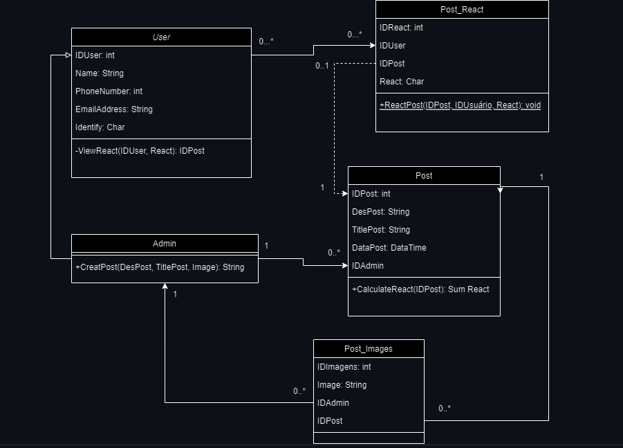

# Arquitetura da Solução

Pré-requisitos: <a href="3-Projeto de Interface.md"> Projeto de Interface</a>

Definição de como o software é estruturado em termos dos componentes que fazem parte da solução e do ambiente de hospedagem da aplicação.

## Projeto da Base de Dados

## Tecnologias Utilizadas

1. Linguagens de Programação:

* C#: Para o desenvolvimento da lógica de negócios e da camada de backend.

*HTML, JavaScript: Para o desenvolvimento da interface do usuário (frontend).

2. Banco de Dados:

* SQL Server: Para armazenar e gerenciar dados relacionados às postagens do blog, comentários, usuários, etc.

3. Framework de Desenvolvimento Web:

* ASP.NET Core: Para desenvolver o backend da aplicação web.

4. ORM (Object-Relational Mapping):

* Entity Framework Core: Para mapear objetos no código C# para as tabelas no banco de dados SQL Server.

5. Frontend Framework:

* ASP.NET MVC: Para construir a interface do usuário no lado do servidor usando C#.

6. IDE (Ambiente de Desenvolvimento Integrado):

* Visual Studio: Como ambiente principal de desenvolvimento, proporcionando suporte para C#, design de interface, depuração e integração com o Git.

7. Controle de Versão:

* Git: Para controle de versão do código-fonte.

## Hospedagem

Explique como a hospedagem e o lançamento da plataforma foi feita.

> **Links Úteis**:
>
> - [Website com GitHub Pages](https://pages.github.com/)
> - [Programação colaborativa com Repl.it](https://repl.it/)
> - [Getting Started with Heroku](https://devcenter.heroku.com/start)
> - [Publicando Seu Site No Heroku](http://pythonclub.com.br/publicando-seu-hello-world-no-heroku.html)
